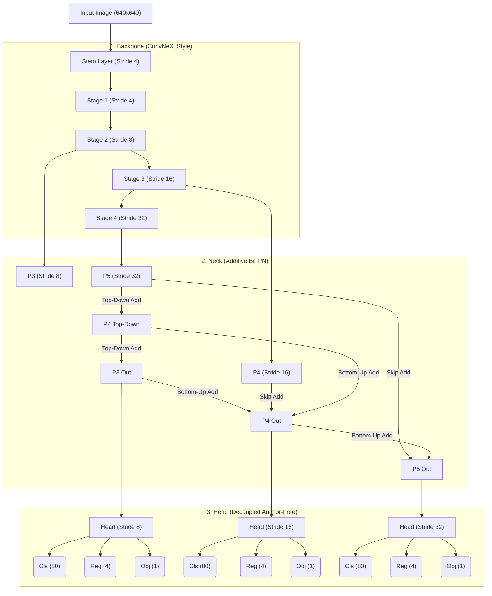

# SOTA CNN Object Detection Architecture

본 문서는 `SOTADetector` 모델의 전체 구조와 데이터 흐름을 시각화하고, 각 모듈의 설계 철학을 설명합니다.

## 1. 전체 아키텍처 도식화 (Mermaid Diagram)

---

## 2. 모듈별 상세 설명

### 2.1. Backbone (ConvNeXt Style NPU-Friendly)
백본은 이미지에서 계층적인 특징(Feature)을 추출하는 뼈대 역할을 합니다.
- **설계 철학**: 원래의 ConvNeXt는 LayerNorm과 GELU를 사용하지만, 모바일 및 NPU 가속 환경에서 막대한 병목을 유발합니다. 이를 해결하기 위해 **BatchNorm2d**와 **Hardswish**로 전면 교체하여 NPU 친화성을 극대화함과 동시에 정확도를 유지합니다.
- **데이터 흐름**: 이미지가 `Stem`을 통과하며 즉시 1/4 크기로 줄어들고(Stride 4), 이후 4개의 Stage를 거치며 최종적으로 1/32 크기(Stride 32)까지 작아집니다.
- **출력**: `Stage 2 (1/8)`, `Stage 3 (1/16)`, `Stage 4 (1/32)`에서 나온 3개의 멀티스케일 피처맵을 Neck으로 전달합니다.

### 2.2. Neck (Additive BiFPN)
넥은 백본에서 추출된 다양한 크기(스케일)의 피처맵들을 서로 융합(Fusion)하는 역할을 합니다.
- **Top-Down & Bottom-Up**: 작은 객체를 잘 찾는 앞쪽 피처맵(P3)과, 전체적인 문맥을 잘 아는 뒤쪽 피처맵(P5)의 정보를 양방향으로 섞어줍니다.
- **하드웨어 최적화 (Additive Fusion)**: 기존 BiFPN은 복잡한 분모 연산(Division)을 사용하지만, 본 아키텍처는 이를 단순 **덧셈(Addition)**으로 대체했습니다. 이는 CPU/NPU 처리 속도를 극대화하고, Int8 양자화 시 소수점 오차로 인한 정확도 붕괴를 막아줍니다.
- **출력 채널 통일**: 입력 채널이 각기 다르더라도, BiFPN을 통과하고 나면 모두 동일한 채널(예: nano=128, medium=256)로 깔끔하게 통일되어 나옵니다.

### 2.3. Head (Decoupled Anchor-Free)
헤드는 최종적으로 물체의 위치(Bounding Box)와 클래스(Class)를 예측하는 부품입니다.
- **Anchor-Free (앵커 프리)**: 미리 정해진 가이드라인(Anchor Box) 없이, 픽셀의 중심점을 기준으로 객체의 너비와 높이를 직접 예측합니다. 코드가 간결해지고 앵커 튜닝에 드는 시간을 절약할 수 있습니다.
- **Decoupled (분리형 구조)**: 
  - `Classification Branch`: 이 픽셀에 있는 것이 강아지인지 자동차인지(80개 클래스) 맞춥니다.
  - `Regression Branch`: 그 객체의 정확한 경계 박스 좌표(4개)를 계산합니다.
  - 이 두 가지 상이한 연산이 같은 가중치를 공유하면 성능이 떨어지므로(Task Misalignment), 두 브랜치를 독립적인 Conv 레이어로 분리하여 정확도(mAP)를 비약적으로 높였습니다.

---

## 3. 모델 스케일링 (Model Scaling)
본 아키텍처는 3가지 티어(Tier)로 손쉽게 스케일링할 수 있도록 설계되었습니다.

| Scale | Backbone Depths | Neck Channels | BiFPN Blocks | 용도 및 타겟 환경 |
| :---: | :--- | :---: | :---: | :--- |
| **nano** | [2, 2, 6, 2] | 128 | 2 | 모바일, 엣지 기기(Raspberry Pi, 스마트폰 NPU) 실시간 추론용 |
| **medium** | [3, 3, 9, 3] | 256 | 4 | 일반적인 서버 환경(ResNet50 대체용), 밸런스형 |
| **xlarge** | [3, 3, 27, 3] | 512 | 6 | 캐글(Kaggle) 대회, 고정밀 의료 영상 등 극강의 SOTA 정확도 요구 |
